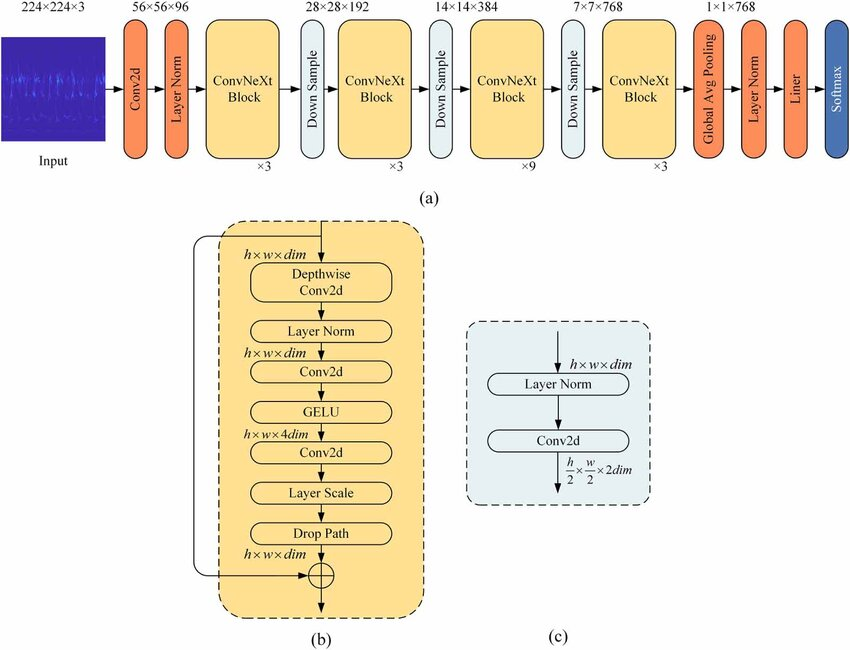
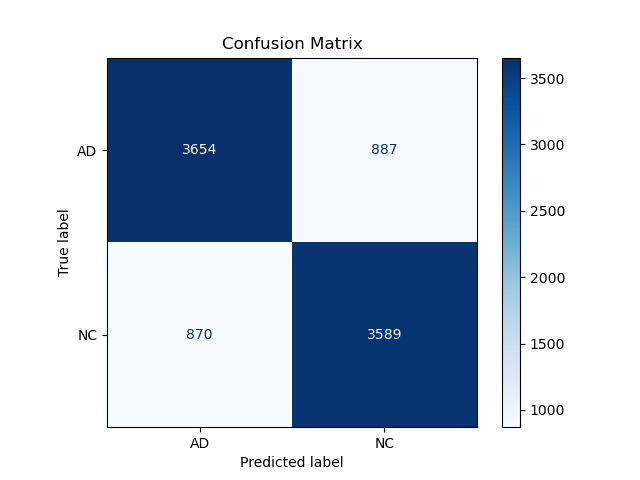
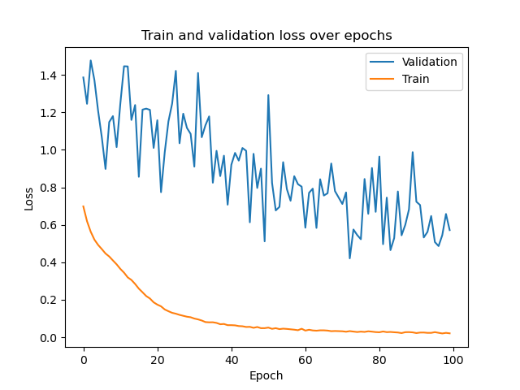
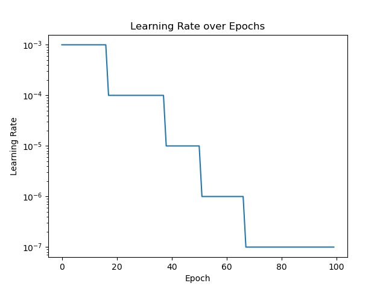

# Classifying Alzheimer's Disease on ADNI Dataset Using ConvNeXt Small

**Author:** Baden Forster (s47442614)

---

## Project Overview

The aim of this project is to make use of MRI scan images of brains in the ADNI dataset to classify the presence of Alzheimer's disease. Making use of the powerful convolutional neural network (CNN) ConvNeXt, we aim to achieve a predictive accuracy of at least 80% in testing.

ConvNeXt [[1](https://doi.org/10.1109/CVPR52688.2022.00547)] is a modern CNN designed to match the performance of Vision Transformers (ViTs) while keeping the efficiency and learning patterns of CNNs. Based on the ResNet-50 architecture, it was updated using design ideas from transformer models.

## Environment Setup

- Download the ADNI dataset and place it in the current directory. It should have the following structure:

```
.
└── ADNI/
    └── AD_NC/
        ├── test/
        │   ├── AD
        │   └── NC
        └── train/
            ├── AD
            └── NC
```

- Download Anaconda3 or Miniconda3
- Install NVIDIA CUDA toolkit
    - Download and install the latest stable version
    - Follow the installation guide for your OS.
- Create `conda` environment:
```bash
conda create -n env python=3.11.5
conda activate env
``` 

- Download dependencies
```bash
pip install torch torchvision numpy pandas matplotlib Pillow scikit-learn
```
- This will install the following dependencies:
    - PyTorch 2.9.0
    - torchvision 0.23.0
    - numpy 2.3.4
    - pandas 2.3.3
    - matplotlib 3.10.7
    - pillow 12.0.0
    - scikit-learn 1.7.2

## Usage

### To train the model on the ADNI train set: 
```bash
python train.py
```
This will save the trained model state dictionary `training_log.csv`, along with a log of training history, a plot of learning rate history `lr_history.png` and a plot of train and validation loss `loss_history.png` to the current directory. 

Using this trained model, inference can be run on the entire test set or a specific image.
### To run inference on the entire test set:
```bash
python predict.py
```
This will save a log of each training image evaluated, its predicted label and its true label `test_results.csv` to the current directory. It will display the confusion matrix and save it to the current directory as `confusion_matrix.png` It will also print the test set accuracy to the console.

### To predict a single image:
```bash
python predict.py --single path/to/image.jpg
```
This will display a figure of the provided image along with its predicted label. 

## Model Architecture / Selection



*ConvNeXt Model Layers & Design.* [[2](https://www.researchgate.net/publication/374280827_Deep_transfer_learning_rolling_bearing_fault_diagnosis_method_based_on_convolutional_neural_network_feature_fusion)]

The ConvNeXt model consists of the following main components:
- **ConvNeXt *block***
    - The main computational unit of the network
    - Makes use of:
        - Depthwise convolution
        - Layer norm
        - Traditional 2d convolution
        - GELU activation
    - This combination of layers efficiently extracts spatial features
- **Down Sample**
    - Reduces the resolution of the features, while increasing the number of channels
    - This allows the network to capture high level features
- **Layer Norm**
    - Standardises feature values 
    - This prevents values from going outside a steady range and helps ensure the model converges
- **Linear Layer**
    - Fully connected layer
    - Projects learned features to logits to be used in classification
- **Softmax Classification Layer**
    - Applies the softmax function to logits attained from the linear layer
    - Gives a probability distribution over the output classes

These components are implemented in the following order:
1. Convolutional layer
    - The model scans the image using convolution to pick up on simple patterns like edges
2. Layer norm
    - Standardises the features learned from the convolution to keep learning steady
3. (ConvNeXt block + down sample) * 3 (stages 1-3)
    - Gradually make the model learn more complex features
    - Downsampling shrinks the image size while increasing channel dimension
    - Repeating the block mutiple times represents learning increasingly complex features 
4. ConvNeXt block + global average pooling (stage 4)
    - Final block layer to learn complex features
    - Pooling summarises learned features to a compact representation
5. Layer norm
    - Normalise result of recursively applied blocks
    - Ensures slassification layers receive clean standard inputs 
6. Linear layer
    - Converts learned features to class logits
7. Softmax classification layer
    - Converts logits to a probability distribution over classes

### Selection of ConvNeXt variants

Two variants of the ConvNeXt model were considered for this problem - small and tiny. 
Both variants share the same overall architecture.
The difference lies in the number of times the ConvNeXt block is repeated in the third stage. In the tiny variant, it is repeated 9 times, while in the small variant it is repeated 27 times [[3](https://github.com/facebookresearch/ConvNeXt/)].

This results in the tiny variant having roughly 29M parameters, and the small variant having roughly 50M parameters. 

The increase in repeated ConvNeXt blocks allows the network to extract richer and more complex features of the training images. This allows it to better capture the differences between AD and NC images.
However, the increase in complexity can lead to overfitting where the model learns unimportant noise in the training images.

The small variant is a good compromise between complexity and computational efficiency, so it was chosen as the model variant for this problem.

## Dataset

The dataset provided by Alzheimer's Disease Neuroimaging Initiative (ADNI) [[4](https://adni.loni.usc.edu/data-samples/adni-data/)] contains 30,520 images of MRI scans of brains, which are labeled into two categories: Alzheimer's Disease (AD) and Normal Control (NC). The training set contains 10,400 AD images and 11,120 NC images. The test set contains 4,460 AD images and 4,540 NC images.

The dataset is fairly balanced between AD and NC, which helps prevent bias toward one class during training. The dataset has a roughly 29% split to test data, which is a reasonable amount with respect to common machine learning research and practise.  

## Data Preprocessing

The `dataset.py` script contains a definition for the `ADNI_Dataset` class, and data transformations used for the test and train datasets. The `ADNI_Dataset` is used in the training and prediction scripts to load the images from the disk and supply them to the model.

### Transforms

Each of the `test_transform` and `train_transform` contain standard manipulations to the images so that they can be effectively used by the model. These include:
- Conversion to greyscale
- Resizing to a standard size $(244 \times 244)$
- Converstion to a PyTorch Tensor
- Normalisation

In addition to this, the `train_transform` contains multiple random transformations that are applied to the image during training to help increase generalisation:
- Random crop to reduce size
- Random small rotation up to 5 degrees
- Random translation by a scale up to 2%
- Random scaling in the range 95% to 105%
- Random color intensity variation

These random transformations aim to increase generalisation by making the model less sensitive to irrelevant variations and more robust to unseen data. The `test_transform` does not contain these random transformations because its purpose is to evaluate the model's true performance on unseen data, not manipulated data.

### Train / Validation split

The dataset is already split into roughly 70% training and 30% testing, but I decided to further split the training set into 20% for validation and 80% for training. This split is a good compromise between being large enough to fairly represent the data distribution while still being small enough to leave most of the data for actual model training. The validation set will be used to tune the model during training. The final data split is the following:
- Test: 9,000 (29.5%)
- Train: 17,216 (56.4%)
- Validation: 4,304 (14.1%)

## Training

The model training involved creating and training a ConvNeXt small model from scratch. Training was performed on the UQ `rangpur` compute cluster with an A100 GPU. The training loop involved the following congiguration and algorithm.


### Configuration

**Loss function**: Binary cross-entropy loss was used for training, which is a commonly used and robust loss function for binary classification.

**Learning rate**: A `ReduceLROnPlateau` learning rate scheduler was implemented for model training. The hyperparameters for this were set using the following.
- Initial learning rate: $10^{-3}$
- Patience: 10
- Factor: 0.1
- Minimum learning rate: $10^{-7}$

The follwing code snippet from `train.py` implements this:

```python
scheduler = torch.optim.lr_scheduler.ReduceLROnPlateau(
    optimiser,
    mode="min",  # minimise validation loss
    factor=0.1,  # reduce LR by a factor of 10
    patience=10,  # wait 10 epochs with no improvement before reducing
    min_lr=1e-7,  # stop reducing below this LR
)
```

A learning rate scheduler such as the one implemented here helps the model reach a better minimum loss, and adapts the learning rate dynamically to the progress of the model's training. This specific scheduler decreases the learning rate when performance is not improving much during training. The performance of the model is measured by validation loss, so when the scheduler sees it hasn't improved in 10 epochs, it reduces the learning rate. This allows the model to make more precise steps in the loss curve and each a better minimum value.

**Optimiser**: An AdamW optimser was used for training. The authors of the original ConvNeXt paper recommended this optimiser for model training since it captures the advantages of transformer model-based training with the benefits of a CNN [[1](https://doi.org/10.1109/CVPR52688.2022.00547)].

**Model checkpointing**: Model checkpointing was implemented in training. The model achieving the best validation loss across the trianing period was saved as the final model. Doing this ensured the model that achieved the best results was used, without overfitting.  

### Training loop

The training loop for the model consists of four main steps, repeated for every epoch.

**1. Forward Pass.** The output of the model is computed for every image in the training set.

**2. Calculate Loss**. The outputs of the model are compared to the images' true labels in order to calculate the value of the loss function. 

**3. Backpropogate Loss**. Stochastic gradient descent (SGD) is used as part of the AdamW optimiser to iterate the model's weights closer to the minimum value. 

**4. Update Scheduler**. The loss is calculated on the validation set to monitor the model's performance during training. The learning rate is reduced if the validation loss hasn't improved within reason.

## Results

### Performance

The model achieved an accuracy of 80.48%. This indicates that the ConvNeXt small architecture was able to effectively differentiate differences between AD and NC images. 

The confusion matrix of the results is shown below, indicating the rate of true positives, true negatives, false positives and false negatives. 



#### Other Performance Metrics

- Precision - 80.77%: Rate of AD predictions that were correct. A high precision tells us the model rarely labels an image as AD unless it truly is. 

- Recall - 80.47%: Proportion of actual AD cases the model correctly identifies. A high recall indicates the model correcly labels an image as AD when it is present.

- F1 - 80.62%: Harmonic mean of precision and recall, balancing both precision and recall. A high F1 means the model performed well in both above cases. 

### Training and Validation Loss

The plot of train and validation loss across the training period is shown below. 



The training loss decreased quickly at the start of the training period, from epochs 1-30, reducing from roughly 0.7 to 0.1. After this point, it remained relatively flat. However, the validation loss decreased more slowly and steadily, hovering around a value of around 0.7 after roughly 60 epochs. The lowest validation loss recorded was 0.46, which occured at epoch 71. Since model checkpointing was used, this model was saved as the final model.

Additionally, the plot shows a clear gap between train and validation loss over the entire training period. This indicates that the model was fitting to the training data very closely, but was not able to generalise as well to unseen data. 

The fluctuations in validation loss also indicate that the model’s performance on the validation set varies between epochs. However, the fact that the validation loss stops decreasing and stabilizes after epoch 60 suggests that the model has reached its best generalization point around that time.

While it is expected that ML models will have a gap between training and validation/test loss, the fact that there is a significant gap between validation and train loss is demonstrates a gap in generalisation. This is a sign that the model is overfitting to some degree. Also, the fact that train loss reduces to a near-zero value shows that the model is learning complex features, so it is definitely not underfitting.

### Learning Rate Scheduler

The plot of learning rate over epochs from the `ReduceLROnPlateau` learning rate scheduler is shown below.



The plot shows that the learning rate starts at $10^{-3}$ and decreases in steps throughout training:

- Epochs 0–19: LR = $10^{-3}$

- Epochs 20–38: LR = $10^{-4}$

- Epochs 39–51: LR = $10^{-5}$

- Epochs 52–64: LR = $10^{-6}$

- Epochs 65–100: LR = $10^{-7}$

This pattern matches the expected behaviour - the learning rate is reduced by a factor of 10 when the validation loss stops improving for a set number of epochs. 

The multiple reductions in the learning rate show that the model hit several plateaus during training, where validation loss stopped improving by a significant amount. At the start of training, the high learning rate ($10^{-3}$) allowed for large, fast updates. This also aligns with the rapid drop seen in training loss at the start of training. However, near the end of training, the learning rate updates had less of an impact, which can be seen by the fact that each learning rate update only lasted slightly longer than the patience parameter (10). This being said, the smaller learning rate did help with fine-tuning the model's weights in the later part of trainig, after the big reduction in loss at the beginning.

Overall, the The `ReduceLROnPlateau` scheduler helped the model converge smoothly by slowing learning as it approached a minimum.

## Potential Extensions and Improvements

### Additional Data

More investigation could be done to incorporate more modes and sources of data to make predictions related to the presence of Alzheimer's disease. For example, other medical imaging such as CT scans could be useful to predict AD. Apart from medical imaging, other clinical data such as patient test data could be used as features to other methods and models could improve prediction outcomes.

### Improvements to the model

There are a few additional strategies that could be implemented to improve model performance and generalisation.
To reduce overfitting, regularization techniques such as dropout, weight decay, and data augmentation could be investigated further.
Additionally, other models and architectures could be investigated, such as other CNN architectures (VGG, ResNet, EfficientNet, etc). Vision transformer models could also be implemented to solve this problem which could provide benefits in global context awareness which could improve performance.

### Interpretability

Investigating the interpretability of the model's outputs is very important since it is making a prediction concering a patient's health. More work could be done to investigate the consequences of false positives and false negatives.

## Conclusion

The powerful ConvNeXt architecture was successfully able to classify AD and NC MRI scan images, achieving an accuracy of over 80%. These are good results for the task but the observed gap between training and validation loss indicates some overfitting that should be mitigated in future work. Overall, this project provides a reproducible baseline and evaluation pipeline for Alzheimer's classification on the ADNI dataset, and the code and checkpoints are provided to facilitate continued experimentation and extension.

## References

1. Liu, Z., Mao, H., Wu, C.-Y., Feichtenhofer, C., Darrell, T., & Xie, S. (2022). A ConvNet for the 2020s. Proceedings of the IEEE/CVF Conference on Computer Vision and Pattern Recognition (CVPR), 2022, 5578–5588. https://arxiv.org/abs/2201.03545

2. Yu, Di & Fu, Haiyue & Song, Yanchen & Xie, Wenjian & Zhijie, Xie. (2023). Deep transfer learning rolling bearing fault diagnosis method based on convolutional neural network feature fusion. Measurement Science and Technology. 35. 10.1088/1361-6501/acfe31. https://www.researchgate.net/publication/374280827_Deep_transfer_learning_rolling_bearing_fault_diagnosis_method_based_on_convolutional_neural_network_feature_fusion

3. Facebook Research. (2023) ConvNeXt [GitHub repository]. https://github.com/facebookresearch/ConvNeXt/

4. Alzheimer’s Disease Neuroimaging Initiative (2025). *ADNI Data*. Retrieved from https://adni.loni.usc.edu/data-samples/adni-data/